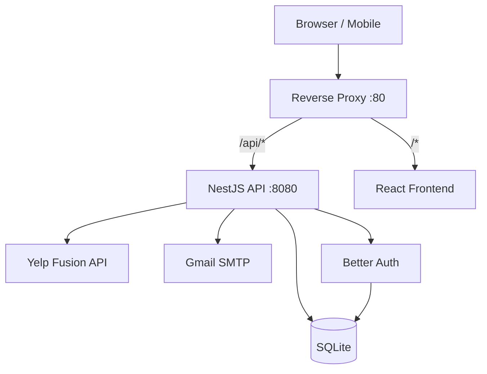

# 🎷 NOLA Spots

**Version:** 2.0.0 <br/>
**Author:** Joseph Adogeri <br/>
 **Date:** May 2026

> Discover, save, and remember the finest food spots in New Orleans — powered by the Yelp Fusion API, Better Auth, and NestJS.

---

## 📋 Table of Contents

<ul>
  <li><a href="#1-introduction">1. Introduction</a>
    <ul>
      <li><a href="#11-purpose">1.1 Purpose</a></li>
      <li><a href="#12-scope">1.2 Scope</a></li>
      <li><a href="#13-intended-audience">1.3 Intended Audience</a></li>
    </ul>
  </li>
  <li><a href="#2-api-reference">2. API Reference</a></li>
  <li><a href="#3-system-architecture">3. System Architecture</a>
    <ul>
      <li><a href="#31-high-level-architecture">3.1 High-Level Architecture</a></li>
      <li><a href="#32-technology-stack">3.2 Technology Stack</a></li>
      <li><a href="#33-folder-structure">3.3 Folder Structure</a></li>
    </ul>
  </li>
  <li><a href="#4-data-design">4. Data Design</a>
    <ul>
      <li><a href="#41-entities">4.1 Entities and Relationships</a></li>
      <li><a href="#42-schema">4.2 Database Schema</a></li>
    </ul>
  </li>
  <li><a href="#5-installation">5. Installation</a></li>
  <li><a href="#6-configuration">6. Configuration</a></li>
  <li><a href="#7-usage">7. Usage</a></li>
  <li><a href="#8-email-system">8. Email System</a></li>
  <li><a href="#9-security">9. Security</a></li>
  <li><a href="#10-bugs-fixed-and-lessons-learned">10. Bugs Fixed &amp; Lessons Learned</a></li>
  <li><a href="#11-license">11. License</a></li>
</ul>

---

<a id="1-introduction"></a>
## **1. Introduction**

<a id="11-purpose"></a>
### **1.1 Purpose**

NOLA Spots is a full-stack web application for discovering, saving, and managing favorite food spots in New Orleans. It provides a clean REST API backed by NestJS and a rich React frontend, with secure user authentication, per-user data persistence, and automated email notifications.

<a id="12-scope"></a>
### **1.2 Scope**

The system allows users to:

- Search New Orleans restaurants via the Yelp Fusion API with category filtering.
- Register and authenticate with email + password (Better Auth).
- Save, like, and mark food spots as visited — persisted per user in SQLite.
- Recover a forgotten password via a generated temporary password sent by email.
- Reset their password using a secure two-step flow (temporary → permanent).
- Deactivate their account, which signs out all active sessions and sends a confirmation email.
- Benefit from automatic session cleanup (expired sessions purged daily at 1 AM).

<a id="13-intended-audience"></a>
### **1.3 Intended Audience**

Backend developers, frontend engineers, and technical reviewers evaluating the application architecture, security posture, and code quality.

---

<a id="2-api-reference"></a>
## **2. API Reference**

All routes are prefixed with `/api`.

### Authentication — `POST /api/auth/*`

| Method | Route | Auth Required | Description |
|--------|-------|:---:|-------------|
| `POST` | `/api/auth/register` | ✗ | Create a new account; triggers welcome email |
| `POST` | `/api/auth/login` | ✗ | Sign in; enforces lockout after 3 failed attempts |
| `POST` | `/api/auth/logout` | ✗ | Invalidate the current session |
| `GET`  | `/api/auth/me` | ✓ | Return the authenticated user profile |
| `POST` | `/api/auth/forgot-password` | ✗ | Generate a temporary password and send it by email |
| `POST` | `/api/auth/reset-password` | ✗ | Swap the temporary password for a new permanent one |
| `POST` | `/api/auth/deactivate` | ✓ | Deactivate the account and revoke all sessions |

#### `POST /api/auth/forgot-password`
```json
{ "email": "user@example.com" }
```

#### `POST /api/auth/reset-password`
```json
{
  "email": "user@example.com",
  "currentPassword": "<temporary password from email>",
  "newPassword": "MyNew$ecure9pass"
}
```

### Yelp Search — `GET /api/yelp/search`

| Query Param | Type | Default | Description |
|-------------|------|---------|-------------|
| `term` | string | `restaurants` | Search keyword |
| `location` | string | `New Orleans, LA` | Location string |
| `category` | string | — | Yelp category filter |
| `limit` | number | `20` | Max results (1–50) |

### Businesses (Saved Spots) — `/api/businesses`

| Method | Route | Description |
|--------|-------|-------------|
| `GET` | `/api/businesses` | List the current user's saved spots |
| `POST` | `/api/businesses` | Save a new spot |
| `PATCH` | `/api/businesses/:id` | Update a spot (liked, visited) |
| `DELETE` | `/api/businesses/:id` | Remove a saved spot |

### Health — `GET /api/healthz`

Returns `{ "status": "ok" }`.

---

<a id="3-system-architecture"></a>
## **3. System Architecture**

<a id="31-high-level-architecture"></a>
### **3.1 High-Level Architecture**

```
┌─────────────────────────────────────────────────────────────────┐
│                        Reverse Proxy                            │
│           (path-based routing, mTLS, shared port 80)           │
└────────────┬─────────────────────────┬───────────────────────── ┘
             │ /api/*                  │ /*
      ┌──────▼──────┐          ┌───────▼──────┐
      │  NestJS API │          │  React/Vite  │
      │  Port 8080  │          │  Frontend    │
      └──────┬──────┘          └──────────────┘
             │
     ┌───────┼────────────────────────────┐
     │       │                            │
┌────▼────┐ ┌▼──────────────┐  ┌─────────▼───────┐
│SQLite│ │ Yelp Fusion   │  │   Gmail SMTP    │
│(Drizzle)│ │    API        │  │  (nodemailer)   │
└─────────┘ └───────────────┘  └─────────────────┘
```



<a id="32-technology-stack"></a>
### **3.2 Technology Stack**

| Layer | Technology | Version |
|-------|-----------|---------|
| Runtime | Node.js | 24 |
| Language | TypeScript | 5.9 |
| Monorepo | pnpm workspaces + Turborepo | 10 / 2 |
| API Framework | NestJS (`@nestjs/platform-express`) | 10 |
| Auth | Better Auth + bearer plugin | 1.6.11 |
| Database | SQLite + Drizzle ORM | 16 / 0.40 |
| Validation | Zod | 3 |
| Email | nodemailer + @nestjs-modules/mailer + Handlebars | 8 / 2 / 4 |
| Scheduling | @nestjs/schedule (cron) | 6 |
| API Codegen | Orval (OpenAPI → Zod + React Query hooks) | 8 |
| Build | esbuild + SWC plugin | 0.27 / 1.15 |
| Frontend | React 19 + Vite + TanStack Query v5 + Framer Motion | — |

<a id="33-folder-structure"></a>
### **3.3 Folder Structure**

```
nola-spots/
├── artifacts/
│   ├── api-server/               # NestJS backend
│   │   ├── src/
│   │   │   ├── main.ts           # Bootstrap (port, CORS, global prefix)
│   │   │   ├── app.module.ts     # Root module
│   │   │   ├── common/
│   │   │   │   ├── auth.guard.ts
│   │   │   │   ├── current-user.decorator.ts
│   │   │   │   └── zod-validation.pipe.ts
│   │   │   ├── auth/             # Auth module (register, login, lockout, reset)
│   │   │   ├── businesses/       # Saved spots module
│   │   │   ├── health/           # Health check
│   │   │   ├── mail/             # Email module (Handlebars templates)
│   │   │   │   └── templates/    # NOLA-themed HBS templates
│   │   │   ├── tasks/            # Scheduled cron jobs
│   │   │   └── yelp/             # Yelp Fusion search
│   │   └── build.mjs             # esbuild + SWC build script
│   └── nola-food/                # React/Vite frontend
├── lib/
│   ├── api-spec/                 # OpenAPI spec (source of truth)
│   ├── api-zod/                  # Generated Zod schemas
│   ├── api-client-react/         # Generated TanStack Query hooks
│   └── db/                       # Drizzle schema + migrations
└── scripts/                      # Utility scripts
```

---

<a id="4-data-design"></a>
## **4. Data Design**

<a id="41-entities"></a>
### **4.1 Entities and Relationships**

```
users ──< sessions
users ──< accounts
users ──< verifications (Better Auth + nola-reset tokens)
users ──< businesses
```

<a id="42-schema"></a>
### **4.2 Database Schema**

#### `users`
| Column | Type | Notes |
|--------|------|-------|
| `id` | text PK | Better Auth generated |
| `name` | text | Display name |
| `username` | text unique | Chosen at registration |
| `email` | text unique | Login identifier |
| `email_verified` | boolean | Default false |
| `login_attempts` | integer | Resets on successful login |
| `locked_until` | timestamptz | NULL when unlocked |
| `is_active` | boolean | False = deactivated |
| `created_at` / `updated_at` | timestamptz | — |

#### `sessions`
Managed by Better Auth. Purged nightly by the session-cleanup cron job.

#### `businesses` (saved spots)
| Column | Type |
|--------|------|
| `id` | text PK |
| `business_id` | text (Yelp ID) |
| `user_id` | text FK → users |
| `name`, `phone`, `rating`, `image_url`, `price`, `address`, `city` | text / real |
| `liked`, `visited` | boolean |

---

<a id="5-installation"></a>
## **5. Installation**

### Prerequisites

- Node.js 24+
- pnpm 10+
- SQLite 16+ (connection string in `DATABASE_URL`)

### Steps

```bash
# 1. Clone the repository
git clone https://github.com/jadogeri/nola-spots.git
cd nola-spots

# 2. Install all workspace dependencies
pnpm install

# 3. Push the database schema
pnpm --filter @workspace/db run push

# 4. Regenerate API types (optional, already committed)
pnpm --filter @workspace/api-spec run codegen
```

---

<a id="6-configuration"></a>
## **6. Configuration**

Create environment variables (or set them in your hosting provider's secrets manager):

| Variable | Required | Description |
|----------|:--------:|-------------|
| `TURSO_DATABASE_URL` | ✅ | Turso database url |
| `TURSO_AUTH_TOKEN` | ✅ | Turso encrypted token |
| `DATABASE_URL` | ✅ | SQLite connection string |
| `CLIENT_PORT` | ✅ | Vite React App assigned port |
| `SERVER_PORT` | ✅ | NestJS App assigned port |
| `BASE_PATH` | ✅ | Configuartion Routing path |
| `SESSION_SECRET` | ✅ | Secret key for Better Auth session signing |
| `YELP_API_KEY` | ✅ | Yelp Fusion API key |
| `GMAIL_USER` | ✅ | Gmail address used to send emails |
| `GMAIL_APP_PASSWORD` | ✅ | Gmail App Password (not your login password) |
| `APP_URL` | ☑ | Public URL of the app (used in email links) |
| `MAIL_FROM` | ☑ | Custom sender string, e.g. `"NOLA Spots" <noreply@example.com>` |
| `BETTER_AUTH_URL` | ☑ | Base URL for Better Auth (defaults to localhost) |

> **Gmail App Password**: Go to Google Account → Security → 2-Step Verification → App Passwords → generate one for "Mail".

---

<a id="7-usage"></a>
## **7. Usage**

```bash
# Start the API server (builds first, then runs)
pnpm --filter @workspace/api-server run dev

# Start the React frontend
pnpm --filter @workspace/nola-food run dev

# Full typecheck (all workspace packages)
pnpm run typecheck

# Build everything
pnpm run build
```

---

<a id="8-email-system"></a>
## **8. Email System**

NOLA Spots sends transactional emails via Gmail SMTP using `@nestjs-modules/mailer` with Handlebars templates. Every template uses the NOLA dark-gold theme (`#1a0f00` background, `#C9A84C` gold).

| Trigger | Template | Description |
|---------|----------|-------------|
| Account registration | `welcome/` | Welcome message with app link |
| Forgot password | `forgot-password/` | 12-char no-lookalikes temporary password |
| Password reset success | `reset-password/` | Confirmation that password was changed |
| 3 failed login attempts | `account-locked/` | Security alert + recovery instructions |
| Account deactivation | `account-deactivation/` | Confirmation + re-registration invite |

### No-Lookalikes Password Generation

Temporary passwords exclude ambiguous characters (`0`, `O`, `1`, `l`, `I`) to prevent transcription errors. Every generated password guarantees: ≥ 2 uppercase, ≥ 2 lowercase, ≥ 2 digits, ≥ 1 special character, shuffled with Fisher-Yates.

### Password Reset Flow

```
User → POST /api/auth/forgot-password { email }
  → Temp password generated (12 chars, no-lookalikes)
  → Hash stored in verifications table (TTL: 1 hour)
  → Better Auth reset token obtained internally
  → Better Auth resets password to temp value
  → Email sent with temp password

User → POST /api/auth/reset-password { email, currentPassword, newPassword }
  → Temp hash verified against stored record
  → Better Auth resets password to newPassword
  → Verification record deleted
  → Account unlocked (loginAttempts = 0)
  → Confirmation email sent
```

---

<a id="9-security"></a>
## **9. Security**

- **Account lockout**: 3 consecutive failed logins → 30-minute lockout + email alert.
- **Password hashing**: Handled entirely by Better Auth (Scrypt via oslo).
- **Temporary passwords**: SHA-256 hashed with a per-user salt before storage; expire after 1 hour.
- **Session management**: Bearer token auth; sessions purged daily at 1 AM (America/Chicago).
- **Input validation**: All request bodies validated through Zod schemas via `ZodValidationPipe`.
- **CORS**: Configured for the app's trusted origins.
- **No sensitive data in logs**: pino-http logs request metadata only.

---

<a id="10-bugs-fixed-and-lessons-learned"></a>
## **10. Bugs Fixed & Lessons Learned**

### Bugs Fixed

| # | Bug | Root Cause | Fix |
|---|-----|-----------|-----|
| 1 | NestJS decorators (`@Injectable`, `@Controller`) broken at runtime | esbuild's built-in TypeScript loader ignores `emitDecoratorMetadata` | Replaced TS loader with SWC plugin in `build.mjs` — SWC handles `legacyDecorator` + `decoratorMetadata` correctly |
| 2 | `@nestjs/microservices` / `@nestjs/websockets` import errors on startup | NestJS lazy-requires these packages even when not used | Added them to esbuild `external` list so they resolve from `node_modules` at runtime (uninstalled = graceful skip) |
| 3 | `GET /api/healthz` returning 500 | Zod import from `@workspace/api-zod` caused a runtime error after bundling due to ESM/CJS mismatch | Simplified health controller to return plain `{ status: 'ok' }` object; Zod validation belongs on request bodies, not static responses |
| 4 | `ts-node` failing to start dev server | ESM workspace libraries (`@workspace/db`, `@workspace/api-zod` use `"type":"module"`) are incompatible with CJS ts-node | Removed ts-node from the dev flow entirely; dev script = `build.mjs` + `node dist/main.js` |
| 5 | Handlebars templates not found after bundling | esbuild bundles all `.ts` into `dist/main.js`; `__dirname` in bundled code = `dist/`, not `src/` | Added a `copyTemplates()` step to `build.mjs` that copies `src/mail/templates/` → `dist/mail/templates/` after every build |
| 6 | `oslo` (Better Auth's password library) missing at runtime | Listed as an esbuild-bundled module but it is ESM-only, causing CJS conversion issues | Added `oslo` to esbuild `external` list; it resolves from `node_modules` (installed as a transitive dep of `better-auth`) |
| 7 | Account lockout counter not decrementing on success | `loginAttempts` was only incremented on failure but never reset | Reset `loginAttempts` and `lockedUntil` to `0 / null` on every successful `signInEmail` call |

### Lessons Learned

- **NestJS + esbuild requires SWC**: The standard NestJS build pipeline uses `tsc` or `ts-jest`. Running NestJS through esbuild needs the SWC plugin to preserve decorator metadata — there is no native esbuild equivalent.
- **ESM workspace packages and CJS bundling**: When a monorepo mixes `"type":"module"` packages (lib packages) with CJS consumers (the NestJS bundle), esbuild handles the boundary cleanly — but tools like `ts-node` in CJS mode cannot traverse the ESM packages. Build-and-run is the only reliable dev pattern.
- **Never store file paths assuming `src/` context at runtime**: With any bundler, `__dirname` shifts to the output directory. Template-heavy NestJS modules (Handlebars, i18n) must copy their assets as a post-build step.
- **Better Auth internal API surface**: Better Auth exposes server-side API methods (`auth.api.*`) that map to its HTTP endpoints. Using them programmatically (without a real HTTP round-trip) is more efficient but requires careful handling of the `headers` parameter. Passing an empty object `{}` works for internal calls.
- **Turborepo caching saves significant CI time**: With `^build` dependencies, packages that haven't changed replay from cache. On a cold build the entire stack compiles in ~8 seconds; on a warm cache it's under 1 second.
- **Zod v3 vs v4**: The workspace pins Zod v3. Importing from `zod/v4` in any package breaks the monorepo-wide type compatibility. Stick to the catalog version.

---

<a id="11-license"></a>
## **11. License**

MIT — see [LICENSE.md](./LICENSE.md).

---

<p align="center">
  Made with ❤️ for the Crescent City · New Orleans, Louisiana
</p>
