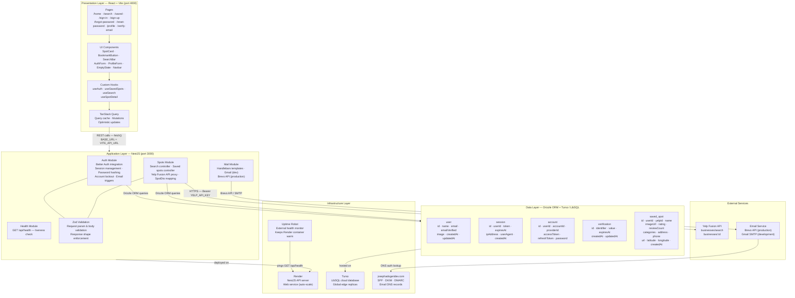
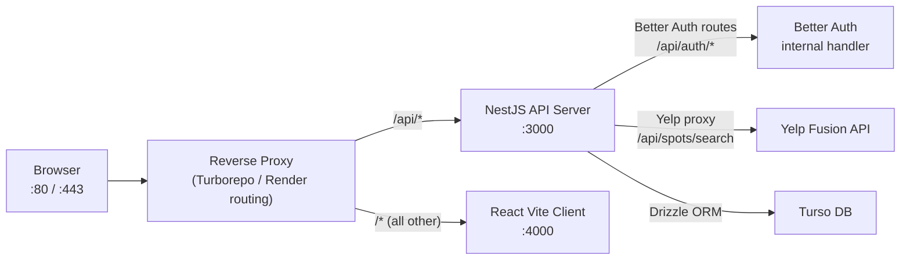
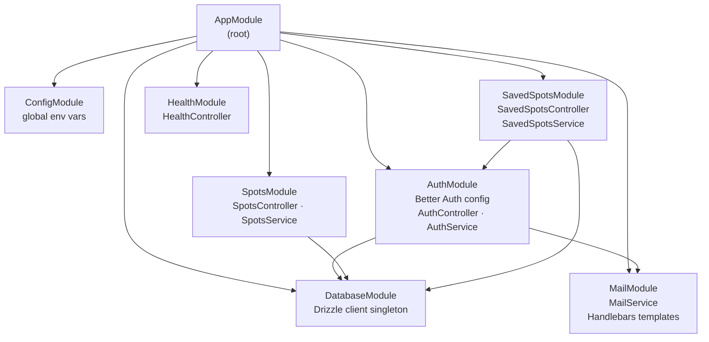

# Architecture Layer Diagram

> **Tool:** Mermaid — paste into [mermaid.live](https://mermaid.live) or any Mermaid-compatible renderer.

## System Architecture — Layer View

---

## Request Routing — Path-Based Proxy

---

## NestJS Module Dependency Graph

