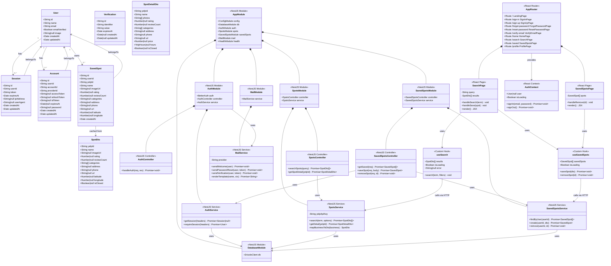

# Class Diagram

> **Tool:** Mermaid — paste into [mermaid.live](https://mermaid.live) or any Mermaid-compatible renderer.

## Full System Class Diagram

```mermaid
classDiagram
    direction TB

    %% ─────────────── Domain / Value Objects ───────────────

    class User {
        +String id
        +String name
        +String email
        +Boolean emailVerified
        +String|null image
        +Date createdAt
        +Date updatedAt
    }

    class Session {
        +String id
        +String userId
        +String token
        +Date expiresAt
        +String|null ipAddress
        +String|null userAgent
        +Date createdAt
        +Date updatedAt
    }

    class Account {
        +String id
        +String userId
        +String accountId
        +String providerId
        +String|null accessToken
        +String|null refreshToken
        +String|null idToken
        +Date|null expiresAt
        +String|null password
        +Date createdAt
        +Date updatedAt
    }

    class Verification {
        +String id
        +String identifier
        +String value
        +Date expiresAt
        +Date|null createdAt
        +Date|null updatedAt
    }

    class SavedSpot {
        +String id
        +String userId
        +String yelpId
        +String name
        +String|null imageUrl
        +Number|null rating
        +Number|null reviewCount
        +String|null categories
        +String|null address
        +String|null phone
        +String|null url
        +Number|null latitude
        +Number|null longitude
        +Date createdAt
    }

    class SpotDto {
        +String yelpId
        +String name
        +String|null imageUrl
        +Number|null rating
        +Number|null reviewCount
        +String[] categories
        +String|null address
        +String|null phone
        +String|null url
        +Number|null latitude
        +Number|null longitude
        +Boolean|null isClosed
    }

    class SpotDetailDto {
        +String yelpId
        +String name
        +String[] photos
        +Number|null rating
        +Number|null reviewCount
        +String[] categories
        +String|null address
        +String|null phone
        +String|null url
        +Number|null price
        +YelpHours|null hours
        +Boolean|null isClosed
    }

    %% ─────────────── NestJS API Layer ───────────────

    class AppModule {
        <<NestJS Module>>
        +ConfigModule config
        +DatabaseModule db
        +AuthModule auth
        +SpotsModule spots
        +SavedSpotsModule savedSpots
        +MailModule mail
        +HealthModule health
    }

    class AuthModule {
        <<NestJS Module>>
        +BetterAuth auth
        +AuthController controller
        +AuthService service
    }

    class AuthController {
        <<NestJS Controller>>
        +handleAuth(req, res) Promise~void~
    }

    class AuthService {
        <<NestJS Service>>
        +getSession(headers) Promise~Session|null~
        +requireSession(headers) Promise~User~
    }

    class SpotsModule {
        <<NestJS Module>>
        +SpotsController controller
        +SpotsService service
    }

    class SpotsController {
        <<NestJS Controller>>
        +searchSpots(query) Promise~SpotDto[]~
        +getSpotDetail(yelpId) Promise~SpotDetailDto~
    }

    class SpotsService {
        <<NestJS Service>>
        -String yelpApiKey
        +search(term, options) Promise~SpotDto[]~
        +getDetail(yelpId) Promise~SpotDetailDto~
        -mapBusinessToDto(business) SpotDto
    }

    class SavedSpotsModule {
        <<NestJS Module>>
        +SavedSpotsController controller
        +SavedSpotsService service
    }

    class SavedSpotsController {
        <<NestJS Controller>>
        +getSaved(req) Promise~SavedSpot[]~
        +saveSpot(req, body) Promise~SavedSpot~
        +removeSpot(req, id) Promise~void~
    }

    class SavedSpotsService {
        <<NestJS Service>>
        +findByUser(userId) Promise~SavedSpot[]~
        +create(userId, dto) Promise~SavedSpot~
        +remove(userId, id) Promise~void~
    }

    class MailModule {
        <<NestJS Module>>
        +MailService service
    }

    class MailService {
        <<NestJS Service>>
        -String provider
        +sendWelcome(user) Promise~void~
        +sendPasswordReset(user, token) Promise~void~
        +sendVerification(user, token) Promise~void~
        -renderTemplate(name, ctx) Promise~String~
    }

    class DatabaseModule {
        <<NestJS Module>>
        +DrizzleClient db
    }

    %% ─────────────── Frontend Layer ───────────────

    class AppRouter {
        <<React Router>>
        +Route / LandingPage
        +Route /sign-in SignInPage
        +Route /sign-up SignUpPage
        +Route /forgot-password ForgotPasswordPage
        +Route /reset-password ResetPasswordPage
        +Route /verify-email VerifyEmailPage
        +Route /home HomePage
        +Route /search SearchPage
        +Route /saved SavedSpotsPage
        +Route /profile ProfilePage
    }

    class SearchPage {
        <<React Page>>
        -String query
        -SpotDto[] results
        +handleSearch(term) void
        +handleSave(spot) void
        +render() JSX
    }

    class SavedSpotsPage {
        <<React Page>>
        -SavedSpot[] spots
        +handleRemove(id) void
        +render() JSX
    }

    class AuthContext {
        <<React Context>>
        +User|null user
        +Boolean isLoading
        +signIn(email, password) Promise~void~
        +signOut() Promise~void~
    }

    class useSearch {
        <<Custom Hook>>
        +SpotDto[] results
        +Boolean isLoading
        +String|null error
        +search(term, filters) void
    }

    class useSavedSpots {
        <<Custom Hook>>
        +SavedSpot[] savedSpots
        +Boolean isLoading
        +saveSpot(dto) Promise~void~
        +removeSpot(id) Promise~void~
    }

    %% ─────────────── Relationships ───────────────

    User "1" --> "0..*" Session : has
    User "1" --> "0..*" Account : has
    User "1" --> "0..*" SavedSpot : owns
    Session --> User : belongsTo
    Account --> User : belongsTo
    SavedSpot --> User : belongsTo
    SavedSpot --> SpotDto : cached from

    AppModule *-- AuthModule
    AppModule *-- SpotsModule
    AppModule *-- SavedSpotsModule
    AppModule *-- MailModule
    AppModule *-- DatabaseModule

    AuthModule *-- AuthController
    AuthModule *-- AuthService
    SpotsModule *-- SpotsController
    SpotsModule *-- SpotsService
    SavedSpotsModule *-- SavedSpotsController
    SavedSpotsModule *-- SavedSpotsService
    MailModule *-- MailService

    SpotsController --> SpotsService : uses
    SavedSpotsController --> SavedSpotsService : uses
    SavedSpotsController --> AuthService : uses
    AuthService --> DatabaseModule : uses
    SpotsService --> DatabaseModule : uses
    SavedSpotsService --> DatabaseModule : uses
    AuthModule --> MailService : uses

    AppRouter *-- SearchPage
    AppRouter *-- SavedSpotsPage
    SearchPage --> useSearch : uses
    SearchPage --> useSavedSpots : uses
    SavedSpotsPage --> useSavedSpots : uses
    useSearch --> SpotsService : calls via HTTP
    useSavedSpots --> SavedSpotsService : calls via HTTP
    AppRouter --> AuthContext : provides
```
