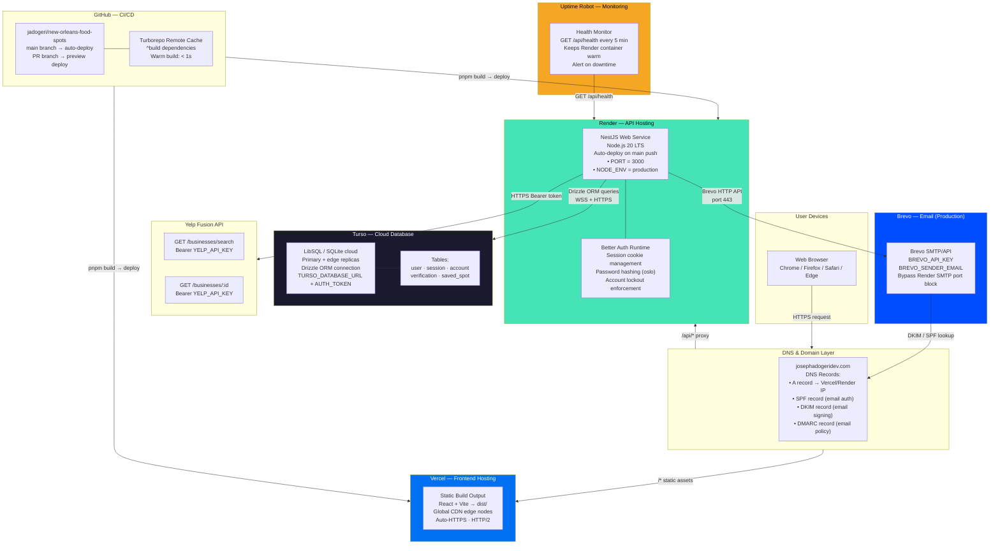
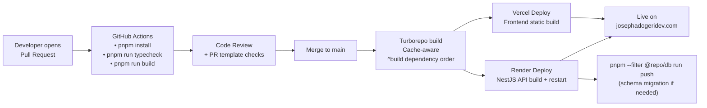

# Deployment Diagram

> **Tool:** Mermaid — paste into [mermaid.live](https://mermaid.live) or any Mermaid-compatible renderer.

## Production Deployment View

---

## Environment Variables — Production vs Development

```mermaid
graph LR
    subgraph DEV["Development (.env)"]
        D1["TURSO_DATABASE_URL\nDev Turso DB URL"]
        D2["YELP_API_KEY"]
        D3["SESSION_SECRET"]
        D4["GMAIL_USER + GMAIL_APP_PASSWORD\n(dev email sending)"]
        D5["CLIENT_PORT=4000\nSERVER_PORT=3000"]
        D6["DATABASE_URL=file:local.db\n(local SQLite fallback)"]
        D7["NODE_ENV=development"]
    end

    subgraph PROD["Production (Render env vars)"]
        P1["TURSO_DATABASE_URL\nProd Turso DB URL"]
        P2["TURSO_AUTH_TOKEN\nProd Turso token"]
        P3["YELP_API_KEY"]
        P4["SESSION_SECRET\nLong random secret"]
        P5["BREVO_API_KEY\nBREVO_SENDER_EMAIL\n(prod email)"]
        P6["FRONTEND_URL\nhttps://josephadogeridev.com"]
        P7["BACKEND_URL\nhttps://nola-api.render.com"]
        P8["BETTER_AUTH_URL\nhttps://nola-api.render.com/api/auth"]
        P9["NODE_ENV=production"]
    end

    DEV -.->|"never commit .env"| PROD
```

---

## CI/CD Pipeline

