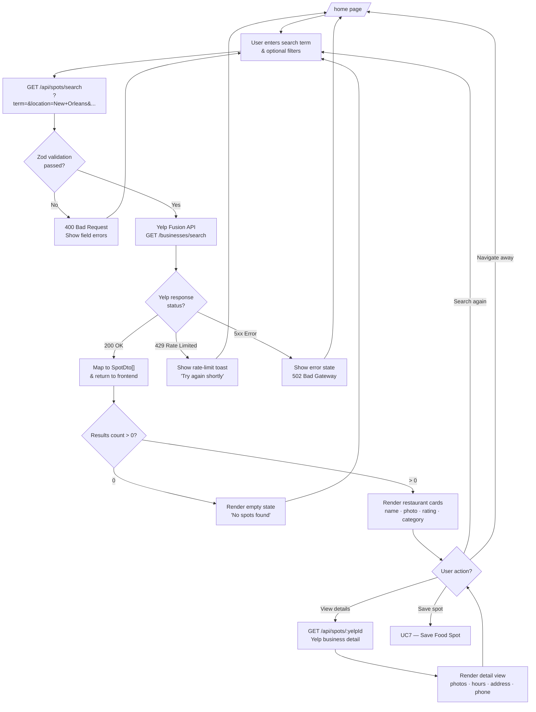

# Process Flow Diagram

> **Tool:** Mermaid — paste into [mermaid.live](https://mermaid.live) or any Mermaid-compatible renderer.

## 1. User Authentication Flow


---

## 2. Search & Discover Flow



---

## 3. Save & Manage Saved Spots Flow

```mermaid
flowchart TD
    CARD[User clicks bookmark icon\non a food spot] --> AUTH_CHECK{Session\nauthenticated?}

    AUTH_CHECK -- No --> REDIRECT_LOGIN[Redirect to /sign-in\nwith return URL]
    REDIRECT_LOGIN --> LOGIN_DONE[User logs in] --> CARD

    AUTH_CHECK -- Yes --> CALL_SAVE[POST /api/spots/saved\n{yelpId, name, imageUrl, ...}]
    CALL_SAVE --> ALREADY_SAVED{409 conflict?\nSpot already saved?}

    ALREADY_SAVED -- Yes --> TOAST_EXISTS[Show "Already in saved spots"\ntoast — no change]
    ALREADY_SAVED -- No 201 --> INSERT_ROW[INSERT INTO saved_spot]
    INSERT_ROW --> BOOKMARK_UPDATE[Update bookmark icon to filled\nShow success toast]

    BOOKMARK_UPDATE --> VIEW_SAVED{User navigates\nto /saved?}
    VIEW_SAVED -- No --> CONTINUE[Continue browsing]
    VIEW_SAVED -- Yes --> CALL_SAVED[GET /api/spots/saved\nSELECT WHERE userId = ?]
    CALL_SAVED --> SAVED_COUNT{Saved spots\ncount > 0?}

    SAVED_COUNT -- 0 --> EMPTY_SAVED[Render empty state\n"No saved spots yet — explore!"]
    SAVED_COUNT -- > 0 --> RENDER_SAVED[Render saved spots grid\nwith Remove button]

    RENDER_SAVED --> REMOVE_ACTION{User clicks Remove?}
    REMOVE_ACTION -- No --> CONTINUE
    REMOVE_ACTION -- Yes --> CALL_DELETE[DELETE /api/spots/saved/:id\nWHERE id=? AND userId=?]
    CALL_DELETE --> DELETE_RESP{Response?}
    DELETE_RESP -- 204 No Content --> REMOVE_CARD[Remove card from list\nShow removal toast]
    DELETE_RESP -- 404 Not Found --> ERR_TOAST[Show error toast]
    REMOVE_CARD --> RENDER_SAVED
    ERR_TOAST --> RENDER_SAVED
```

---

## 4. Email Notification Lifecycle


