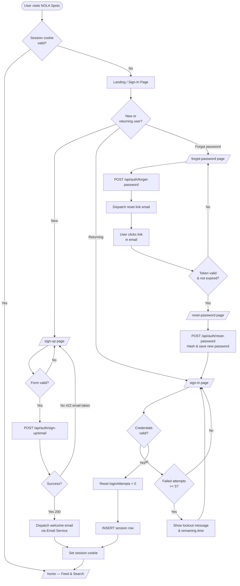
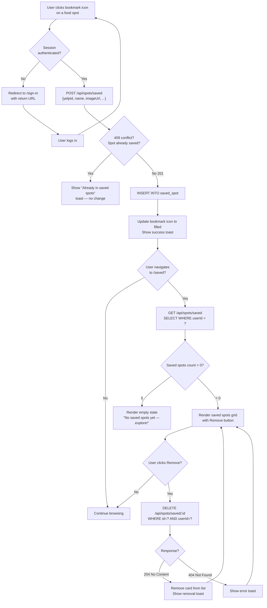

# Process Flow Diagram

> **Tool:** Mermaid — paste into [mermaid.live](https://mermaid.live) or any Mermaid-compatible renderer.

## 1. User Authentication Flow

---

## 2. Search & Discover Flow

---

## 3. Save & Manage Saved Spots Flow

---

## 4. Email Notification Lifecycle

