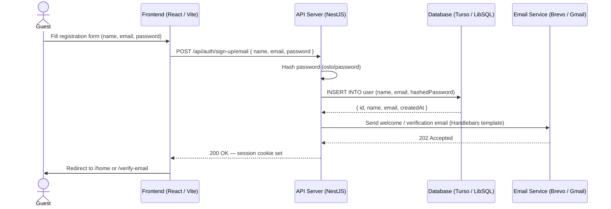
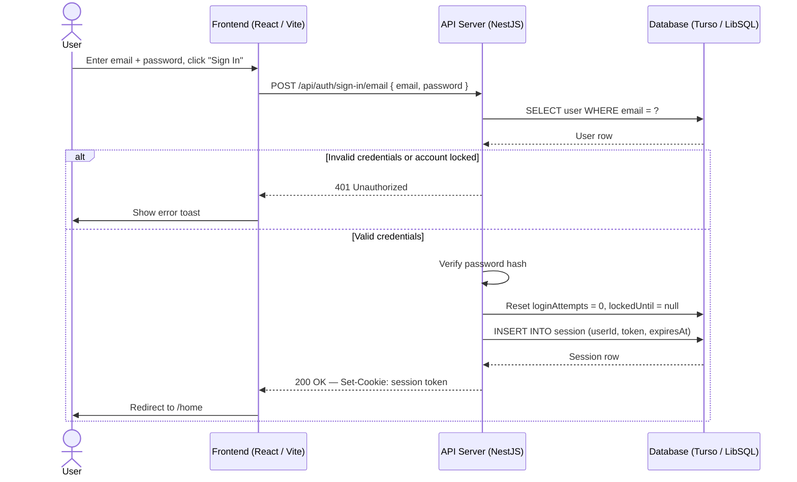
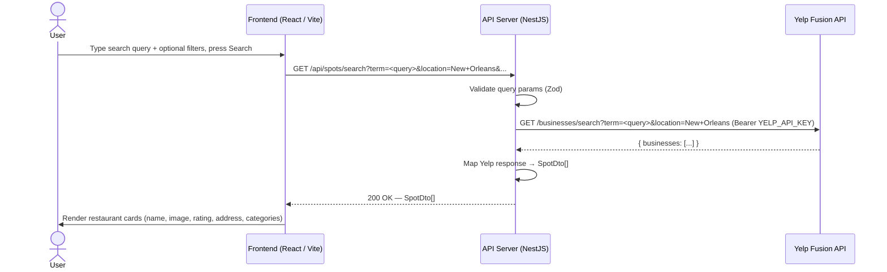
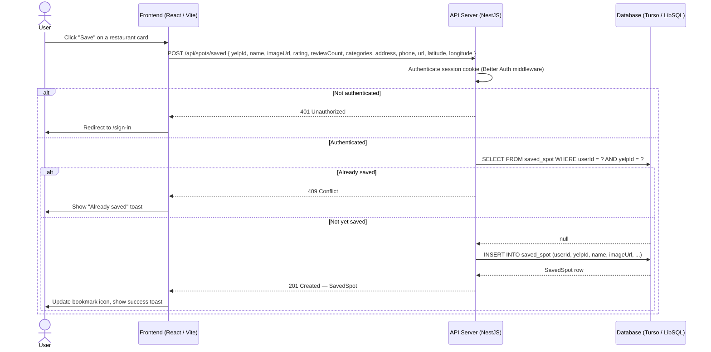
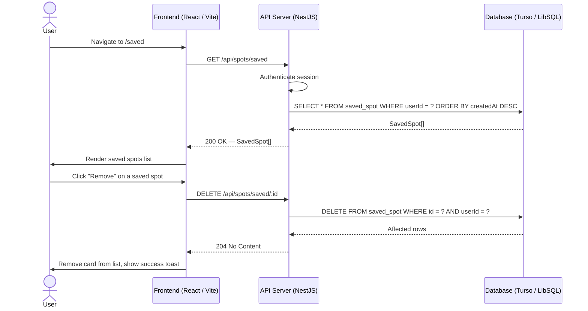
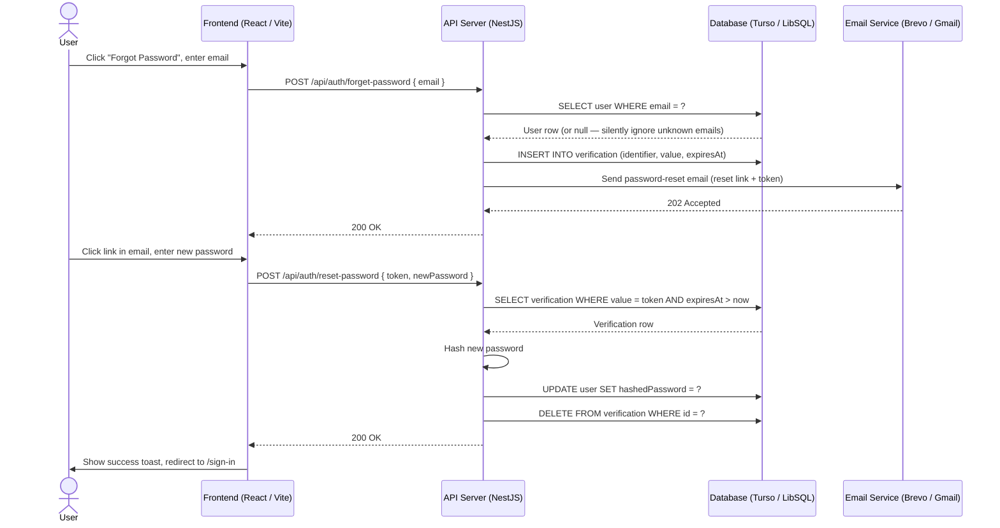

# Sequence Diagram

> **Tool:** Mermaid — paste into [mermaid.live](https://mermaid.live) or any Mermaid-compatible renderer.

## 1. User Registration & Email Verification Sequence

---

## 2. User Login Sequence

---

## 3. Search Food Spots Sequence

---

## 4. Save a Food Spot Sequence

---

## 5. View & Remove Saved Spots Sequence

---

## 6. Password Reset Sequence

